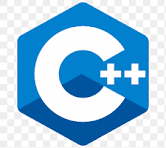
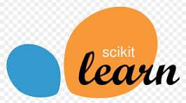

<!-- 🌌 TYPING BANNER (UNCHANGED) -->

  

  

## 🌌 About Me  
🎓 M.Tech in **Quantum Computing**, DIAT (DRDO), Pune  
🔭 Focus Areas: **Quantum Algorithms, QAOA, Quantum Machine Learning**  
🧪 Hands-on with **Qiskit, PennyLane, Cirq, CUDA-Q, QuTiP**  
🌱 Learning **CUDA-Q & Julia**  
📫 Email: **prashik_s@mt.iitr.ac.in**  
📁 Portfolio:  
👉 [Google Drive – Projects & Resume](https://drive.google.com/drive/folders/1fq0HCQyhQqE3LFD7OWy-MeEW0QIxBVnW)

## 🏆 GitHub Trophies

  

# 📊 GitHub Stats:
 
 

# 🌐 Connect With Me  

  

  

# 🧠 Quantum Software Stack  

  

# 🔧 Other Programming & ML Tools  

  

# 🏆 IBM Quantum Digital Badges  

  

# 🚀 Featured Quantum Projects  

### 🔹 Fully Quantum Shor’s Algorithm  
- Modular exponentiation blocks  
- QFT period estimation  
- Noisy vs ideal benchmarks  

---

### 🔹 Quantum Galton Board  
- Multi-layer QGB simulator  
- Distribution shaping  
- Statistical distance evaluation  

  

# 🌌 Quantum Roadmap — Neon Emoji Edition  

<table><tr>
<td align="center" width="260">🧬 <b>2021–2022</b> Foundations LA • QM • Python</td>
<td align="center" width="260">💠 <b>2022–2023</b> Quantum Programming Qiskit • Cirq • PennyLane</td>
<td align="center" width="260">⚛️ <b>2023–2024</b> Variational Algorithms QAOA • VQE</td>
</tr></table>

 

<table><tr>
<td align="center" width="260">🧠 <b>2024</b> Quantum ML QNNs • PyTorch</td>
<td align="center" width="260">🔭 <b>2024–2025</b> Experimental QC HBT • g²(0)</td>
<td align="center" width="260">🚀 <b>2025</b> Advanced Research QRC • CUDA-Q</td>
</tr></table>

